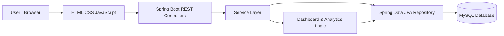
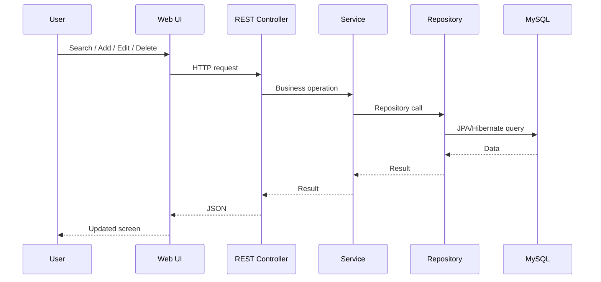

# PayTrack Architecture

## Architecture Diagram

## Request Flow

## Layers

### Controller
Package: `com.paytrack.employee_salary_app.controller`

Defines REST endpoints and delegates operations to services.

### Service
Package: `com.paytrack.employee_salary_app.service`

Contains employee operations, dashboard calculations and salary analytics.

### Repository
Package: `com.paytrack.employee_salary_app.repository`

Uses Spring Data JPA for database access and employee search/filter queries.

### Entity
Package: `com.paytrack.employee_salary_app.entity`

Contains the `Employee` JPA entity mapped to the `employees` table.

### Configuration
Package: `com.paytrack.employee_salary_app.config`

Contains data seeding and Spring Security configuration.

## Frontend
The current frontend uses `index.html`, `style.css`, and `app.js` under `src/main/resources/static/`.

## Performance Design
The UI displays only the first 50 employee records to avoid creating 10,000 DOM rows. For production, use backend pagination with Spring Data `Pageable`, database indexes, DTOs and SQL-side aggregation.

## Security
The current local development configuration permits API requests for easier testing. Production should use real authentication/authorization, environment-based secrets and hardened security settings.
