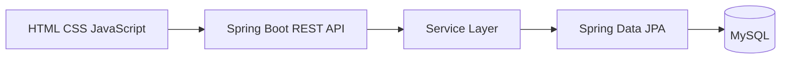

# PayTrack — Employee Salary Management & Analytics

PayTrack is a Spring Boot web application for employee salary management and payroll analytics.

## Features
- Employee dashboard
- Search and filtering
- Add employee
- Update salary
- Delete employee
- Salary analytics
- Payroll by country
- Payroll by department
- REST APIs
- MySQL persistence
- 10,000-record development data seeder

## Tech Stack
- Java 21
- Spring Boot 4.x
- Spring Web
- Spring Data JPA
- Spring Security
- Spring Validation
- MySQL
- Maven
- HTML/CSS/JavaScript

## Architecture

## Documentation
- [Requirements](requirements.md)
- [Architecture](ARCHITECTURE.md)
- [How to Run](HOW_TO_RUN.md)
- [AI Prompts & Usage](AI_PROMPTS_AND_USAGE.md)
- [Trade-offs](TRADE_OFFS.md)
- [Performance](PERFORMANCE.md)

## Security
Never commit real database passwords, API keys, tokens or other secrets.

